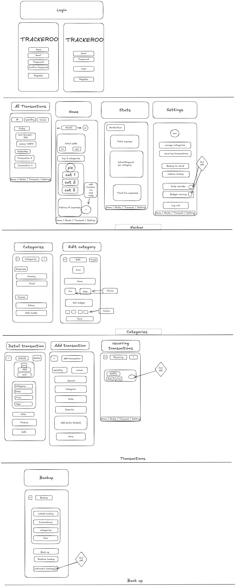

# Projectdoelen - MDE

_gebruik dit markdown bestand om je project te beschrijven en je geplande features aan te duiden._

## Beschrijving

Beschrijf het doel en werking van je app.

(budget tracker) Trackeroo is een mobiele applicatie waarmee gebruikers hun persoonlijke financiën kunnen beheren door inkomsten en uitgaven bij te houden.
Het doel van de app is om gebruikers meer inzicht te geven in hun uitgavenpatroon en hen te helpen bewuster om te gaan met hun geld.

De app is bedoeld voor iedereen die zijn of haar financiën wil bijhouden. Dit kan gaan over studenten, werkende mensen of wie dan ook die beter wil begrijpen waar hun geld naartoe gaat.

- De gebruiker maakt een account aan
- Gebruiker voegt zijn maandelijkse inkomsten toe
- Gebruiker schrijft elke uitgave op in de app met de geassocieerde categorie, datum en optioneel een beschrijving en foto van de kassabon
- Gebruiker kan een maandelijks budget instellen per categorie. Ook kan de gebruiker categorieën toevoegen of verwijderen
- Gebruiker krijgt een visueel overzicht te zien op zijn dashboard met alle info over zijn gedrag met geld
- Gebruiker ontvangt een notificatie bij 100% besteding van het budget. Ook kan de gebruiker een dagelijkse herinnering aanzetten zodat hij niet vergeet zijn gegevens aan te vullen
- Gebruiker kan zijn data backuppen naar de cloud en deze op een ander apparaat herstellen.

## Online strategie

Kruis je online **strategie** aan:

- [ ] Online CRUD operaties met een Backend Service
- [ ] Online Fetch, Offline CRUD
- [x] Offline CRUD, Online Push
- [ ] Online CRUD operaties met eigen REST API
- [ ] Andere, namelijk:

## Mobile features

Kruis je geplande **mobile features** aan:

- [x] Platformintegraties
      noteer welke: - Camera: Foto's nemen van kassabonnen bij elke uitgave
- [x] Push notifications
- [ ] 2D Graphics
- [x] Authentication en Authorization
- [ ] Native Communication
- [ ] Native Speech to Text
- [ ] Cross-platform Native Plugin
- [ ] Andere, namelijk:

## Wireframes

Plaats hier de wireframes die je uploadde naar `/reports/wireframes` (gebruik relatieve verwijzingen).

De wireframe toont alle 12 schermen van de applicatie

- Authenticatie (Login & Registratie)
- Dashboard met maandoverzicht
- Transactie detail pagina
- Recurring transactions
- Categorie toevoegen/bewerken
- Settings & sync management

* Naast de geplande features

1. Recurring Transactions toegevoegd

   - Automatische maandelijkse transacties
   - Zoals huur, salaris, subscriptions

2. Offline-First Architecture

   - App werkt volledig zonder internet
   - Auto-sync wanneer online komt

3. Advanced Filtering & Grouping

   - Transacties gegroepeerd per datum
   - Filter op type (Income/Expense)

4. Month Navigation
   - Swipe tussen maanden
   - Vergelijk uitgaven over tijd
